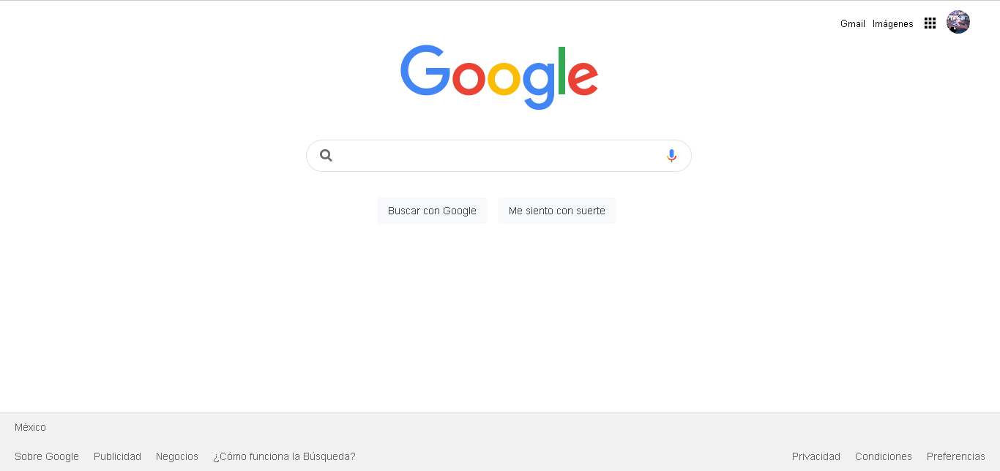

# Clon de Google: Tecnolochicas PRO

Descripción del proyecto: 
Este proyecto se enfocó en desarrollar lo aprendido durante un par de semanas con el Bootcamp. Basicamente se muestra un clon de Google Chrome, donde más que nada el diseño fué la práctica principal en este trabajo,

Incluye la seccion: Interfaz de inicio que nos ofrece Google Clone.
<a href="https://transcendent-pasca-8038d8.netlify.app/" target="_blank">**Échale un ojo** </a>

## Secciones

Interfaz:

## Tecnologías utilizadas
- HTML
- CSS

## Contactame
https://www.linkedin.com/in/salma-ahtziri/

https://github.com/salmaahtziri9

© 2023 Salma Ahtziri Rocha Florida
